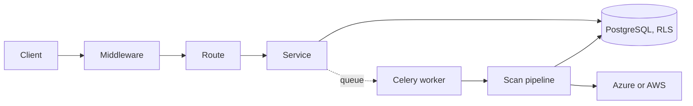

# Cleave API

The backend of Cleave, which was called CloudGuard: a FastAPI service and a Celery worker that
share this package. It reads a customer's cloud without write access, evaluates what it finds
against deterministic rules, scores the results as business risks, and verifies a fix on the next
scan. This file is for someone working in `apps/api`. The product is described in
[`docs/PRODUCT_SPEC.md`](../../docs/PRODUCT_SPEC.md) and the repository in the
[root README](../../README.md).

- [Quick start](#quick-start)
- [Commands](#commands)
- [Configuration](#configuration)
- [Running the API and the worker](#running-the-api-and-the-worker)
- [How a request flows](#how-a-request-flows)
- [Layout](#layout)
- [Rules this code holds to](#rules-this-code-holds-to)
- [Testing](#testing)
- [Generated files](#generated-files)
- [Troubleshooting](#troubleshooting)
- [See also](#see-also)

## Quick start

You need Python 3.12 and, for the git hooks, Node 22. From the repository root:

```bash
tools/dev/setup.sh              # a virtualenv here, the web app's packages, and the git hooks
cd apps/api
source .venv/bin/activate
ruff check . && mypy app && pytest -q tests/unit
```

The unit tests need no database, no network and no cloud account: rule tests read recorded JSON
from `tests/fixtures/`. There is deliberately no mock connector in `app/`.

## Commands

Run these from `apps/api` with the virtualenv active.

| Task | Command |
|---|---|
| Lint, and format | `ruff check .`, `ruff format .` |
| Type check | `mypy app` |
| Unit tests | `pytest -q tests/unit` |
| One test | `pytest -q -k "test_name"` |
| Integration tests | `pytest -q tests/integration`, after [the setup below](#integration-tests) |
| Apply migrations | `alembic upgrade head` |
| Regenerate the OpenAPI document | `python scripts/generate_openapi.py` |
| Regenerate the rule catalog | `python scripts/generate_rule_catalog.py` |
| Measure docstring coverage | `python scripts/check_doc_coverage.py --fail-under 80` |

`tools/dev/api.sh <tool>` runs one of the dev tools from this virtualenv, which is how the
commit hooks call them. Never commit with `--no-verify`: CI runs the same checks.

## Configuration

Every setting is an environment variable, read once by `app/core/config.py` and checked at start.
There is no local run mode and no localhost default: unless `APP_ENV=test`, the API refuses to
start with an incomplete environment, lists every problem at once, and rejects a `localhost` value
as a default that leaked into a deployment.

These are required:

| Variable | What it is |
|---|---|
| `DATABASE_URL` | The row-level-security-constrained `cloudguard_app` role. Every request uses it. |
| `DATABASE_OWNER_URL` | The owner role, for migrations only. |
| `REDIS_URL` | The Celery broker, and the rate-limit counters. |
| `SUPABASE_URL` | The Supabase project. Token signing keys are fetched from its JWKS. |
| `SUPABASE_PUBLISHABLE_KEY` | The project's public key. |
| `AZURE_CONSENT_STATE_SECRET` | Signs the consent round trip. Generate with `openssl rand -hex 32`. |
| `APP_URL` | The deployed frontend, where the consent callback sends the browser. |
| `CORS_ORIGINS` | The frontend's origin, as a comma-separated list or a JSON array. |

Set these where they apply:

- `DATABASE_WORKER_URL` is the worker's own constrained role. Left unset, the worker falls back to
  the owner connection, which bypasses row-level security, so set it wherever tenant isolation
  matters.
- `SUPABASE_JWT_SECRET` is needed only for a legacy project that signs with a shared secret.
- `AZURE_CLIENT_ID`, `AZURE_CLIENT_SECRET`, `AZURE_TENANT_ID` and `AZURE_REDIRECT_URI` are Cleave's
  own multi-tenant Entra app. The redirect URI must match the registration exactly.
- `AWS_ENABLED` and the `AWS_*` identity switch on the AWS connector, which has never run against
  a live account (see [`docs/AWS_INTEGRATION.md`](../../docs/AWS_INTEGRATION.md)).
- `SENTRY_DSN`, `LOG_LEVEL`, `TRUSTED_PROXY_HOPS` (1, for the platform's proxy), the `RATE_LIMIT_*`
  values and `MAX_REQUEST_BYTES` have defaults described in `config.py`.

No secret belongs in the repository. `infrastructure/supabase/roles.sql` keeps a placeholder
password, and CI refuses a commit that replaces it.

## Running the API and the worker

Both run from the same image, `infrastructure/docker/api.Dockerfile`, as a non-root user with the
pango libraries WeasyPrint needs for PDF reports. Railway's start commands are in
`infrastructure/railway/`:

```bash
# API: migrate, then serve. /health is liveness; /health/ready checks the database and the broker.
alembic upgrade head && uvicorn app.main:app --host 0.0.0.0 --port "${PORT:-8000}"

# Worker: the three queues, with the scheduler for the periodic sweeps.
celery -A app.workers.celery_app.celery_app worker --beat \
  --queues=celery,collect,analyze --loglevel=INFO --concurrency=2
```

Migrations live in `database/migrations`, not here; `alembic.ini` points at them. A migration runs
as the owner role. The deployment walkthrough is [`docs/DEPLOYMENT.md`](../../docs/DEPLOYMENT.md).

## How a request flows



Middleware stamps a request id, counts the rate limit and caps the body. The route verifies the
token, derives the organization from the caller's membership, authorizes, calls one service and
shapes the envelope `{ "data", "error", "meta" }`. The service holds the rules and the queries. A
scan is durable steps (plan, collect per subscription, analyze), each claimed under a lease and
written through `ScanWriter.commit`. [`docs/ARCHITECTURE.md`](../../docs/ARCHITECTURE.md) has the
full picture.

## Layout

```text
app/
├── main.py          the FastAPI app, middleware order, health checks
├── api/             router.py, routes/ (one module per area), links.py (Location, Retry-After)
├── core/            settings, auth, tenant context, errors, middleware, redaction, logging
├── schemas/         Pydantic request and response models, and the Envelope
├── services/        business rules and queries, one module per area; scan/ is the pipeline
├── models/          SQLAlchemy tables
├── domain/          the cloud-neutral resource model rules operate on
├── connectors/      the provider seam: azure/ and aws/, onboarding, change events
├── rules/           deterministic checks per provider, a registry and the engine
├── risk/            scoring: severity, criticality, sensitivity and exposure
├── graph/           the asset graph: attack paths, access, severance, identity
├── compliance/      framework catalogue and crosswalk, as data, and per-control coverage
├── context/         inferring an asset's environment and criticality, and overruling it
├── remediation/     how to fix: commands, policies and Terraform edits
├── reports/         HTML and PDF report rendering
├── workers/         the Celery app and its tasks
└── repositories/    reserved for a query two services share; empty today
scripts/             the generators and the docstring check
tests/               unit/, integration/, fixtures/
```

## Rules this code holds to

Each is enforced by a test or a hook where a tool can see it, and the reasoning is in
[`docs/DECISIONS.md`](../../docs/DECISIONS.md).

- **The tenant comes from the token, never the request.** Row-level security enforces it again
  under `cloudguard_app`, a role that owns no tables (§1).
- **Routes are thin.** A route parses, authorizes, calls a service and shapes the answer; it holds
  no queries. A service flushes and never commits, because the caller's RLS claims live in the
  request's transaction: the route commits once (§194).
- **A request body derives from `RequestModel`**, which refuses a field it does not know, and a
  route declares `Envelope[Data, Meta]` and documents its errors (§157, §194).
- **Rules are deterministic and per provider.** No network, database or model call inside a rule;
  UNKNOWN is never PASS; one rule never branches on provider (§74).
- **Nothing blocks the loop.** Blocking or heavy work runs in a thread, and no pooled connection
  idles on a slow call (§158, §161).
- **A customer's URL is called only through `core/outbound.post_json`**, and a credential carried
  in a URL is redacted from the access log and Sentry (§164, §195).

## Testing

`tests/unit` runs anywhere. `tests/integration` needs PostgreSQL 16 and Redis 7 and is marked
`@pytest.mark.integration`; CI provisions both as service containers, and that run is the
supported one.

### Integration tests

The tests must connect as `cloudguard_app`. Run as the owner, a tenant-isolation test passes while
proving nothing.

```bash
export DATABASE_URL='postgresql+asyncpg://cloudguard_app:<password>@localhost:5432/cloudguard'
export DATABASE_OWNER_URL='postgresql+asyncpg://cloudguard:<password>@localhost:5432/cloudguard'
export DATABASE_WORKER_URL='postgresql+asyncpg://cloudguard_worker:<password>@localhost:5432/cloudguard'
export REDIS_URL='redis://localhost:6379/0'
export SUPABASE_JWT_SECRET='<any test value>'
export APP_ENV=test

psql "<owner connection>" -f ../../infrastructure/ci/postgres-roles.sql   # once, to create the roles
alembic upgrade head
pytest -q tests/integration
```

The throwaway passwords CI uses are in [`.github/workflows/ci.yml`](../../.github/workflows/ci.yml).
Two tests depend on the machine: the PDF integration test needs WeasyPrint's native libraries
(pango, cairo, harfbuzz), and the real-fetcher report tests skip without them.

## Generated files

CI regenerates both and fails on a difference, so a route or a rule changed without them is caught.

| File | Generated by |
|---|---|
| `docs/api/openapi.json` and `docs/api/index.html` | `scripts/generate_openapi.py` |
| `docs/RULE_CATALOG.md` | `scripts/generate_rule_catalog.py` |

Both scripts take `--check`, which compares without writing. Do not edit either file by hand.

The endpoint list in `docs/API.md` is written by hand, including the routes the OpenAPI document
leaves out. `tests/unit/test_api_doc_endpoints.py` fails when it disagrees with the routes the app
serves, so add a line there in the same change as a route.

## Troubleshooting

- **The API will not start and prints a list of unset variables.** That list is the
  [required settings](#configuration). A `localhost` value is refused on purpose.
- **A body that used to work now answers `422` with `extra_forbidden`.** Request models refuse
  fields they do not declare; remove the field or add it to the model.
- **Integration tests pass but isolation tests prove nothing.** `DATABASE_URL` points at the owner.
  It must be `cloudguard_app`.
- **A test fails on a pin you did not change.** The virtualenv is behind `pyproject.toml`; run
  `tools/dev/setup.sh` again.
- **The PDF report test fails with a missing library.** Install the native libraries named above.

## See also

- [`docs/API.md`](../../docs/API.md): the endpoints, the envelope, headers and authentication.
- [`docs/API_GUIDELINES.md`](../../docs/API_GUIDELINES.md): how an endpoint is designed, with a
  checklist for a new one.
- [`docs/api/openapi.json`](../../docs/api/openapi.json): the generated contract.
- [`docs/PYTHON_GUIDELINES.md`](../../docs/PYTHON_GUIDELINES.md) and
  [`docs/STANDARDS.md`](../../docs/STANDARDS.md): the style and the checks that hold it.
- [`docs/TESTING.md`](../../docs/TESTING.md), [`docs/SECURITY.md`](../../docs/SECURITY.md) and
  [`docs/RULE_ENGINE.md`](../../docs/RULE_ENGINE.md).
