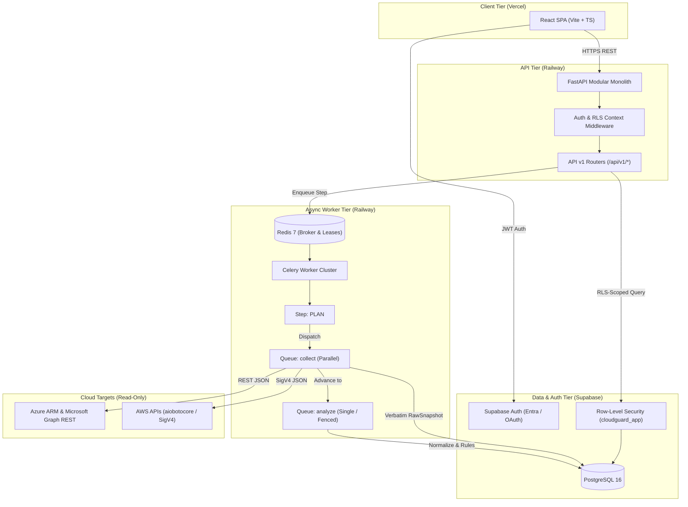
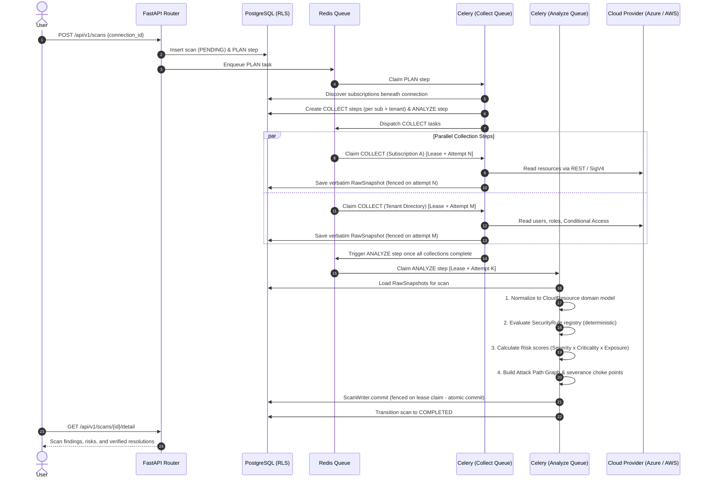
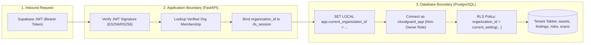
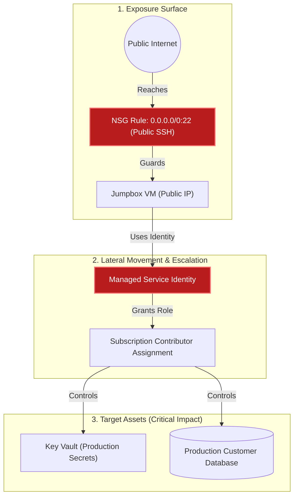

# CloudGuard — Architecture

See `PRODUCT_SPEC.md` for vision/scope. This doc covers the technical shape: stack, repo layout, request flow, multi-tenancy, and roles.

---

## 1. Tech Stack

| Layer | Choice |
| --- | --- |
| Frontend | React, TypeScript, Vite, Tailwind CSS, shadcn/ui, React Router, TanStack Query, Recharts, Motion |
| Backend | Python, FastAPI, Pydantic, SQLAlchemy 2, Alembic, Pytest, Ruff, MyPy |
| Database / Auth | Supabase PostgreSQL + Supabase Auth + PostgreSQL Row-Level Security (a real security boundary, not a frontend convenience) |
| Background jobs | Celery + Redis |
| Cloud | Azure Resource Manager REST, Microsoft Graph REST, Microsoft Entra ID, MSAL for tokens — **not** the `azure-mgmt-*` SDKs, so the raw JSON can be stored verbatim and re-evaluated (`DECISIONS.md` §3) |
| Infra | Docker image built by Railway, GitHub Actions (CI). No local runtime. |
| Testing | Pytest (unit + an `integration` marker needing live PostgreSQL), Vitest. No E2E runner — see `TESTING.md` §5 |
| Monitoring | Sentry now; OpenTelemetry later |
| Reports | Jinja2 + WeasyPrint |
| Architecture style | **Modular monolith + worker.** Explicitly NOT microservices. |

Do not change this stack unless development proves it necessary.

---

## 2. Request / Data Flow



### Scan Step Orchestration Sequence

A scan is not one queued task. It is a set of durable steps — `PLAN`, one `COLLECT` per subscription plus one for the tenant directory, then `ANALYZE` — recorded in `scan_steps` and claimed under a lease by whichever worker is free.



Collection and analysis go to different queues because they cost opposite
things: collection waits on Azure and wants many in flight, analysis holds a
tenant in memory and wants few. What makes it survivable is that the state lives
in the database rather than in a Python frame: a redeploy costs the step in
flight rather than the scan, one unreadable subscription does not take the other
forty-nine with it, and every write a running step makes is fenced on the claim
it was made under, so a worker that was merely slow cannot settle a step another
worker is running (`services/orchestrator.py`, `DECISIONS.md` §65).

---

## 3. Repository Structure

Monorepo.

```
cloudguard/
|-- apps/
|   |-- web/                      # React + Vite
|   |   `-- src/, package.json, vite.config.ts
|   `-- api/
|       |-- app/
|       |   |-- main.py
|       |   |-- core/            # config, enums, security, logging, dependencies
|       |   |-- api/routes/      # organizations, cloud_accounts, cloud_connections,
|       |   |                     # scans, assets, findings, risks, attack_paths,
|       |   |                     # remediation, compliance, reports, rules,
|       |   |                     # dashboard, changes, events
|       |   |-- models/, schemas/, repositories/, services/
|       |   |-- domain/          # CloudResource -- the evaluation-time view, no DB, no SDK
|       |   |-- connectors/     # base.py, collection.py, planning.py, evidence.py,
|       |   |                     # onboarding.py, registry.py -- all provider-neutral
|       |   |-- connectors/azure/, connectors/aws/
|       |   |-- context/         # asset context: inferred, then overruled by declaration
|       |   |-- graph/           # AssetGraph: attack paths, escalation chains, severance, patterns
|       |   |-- rules/azure/{identity,rbac,network,storage,compute,database,logging,secrets,posture}/
|       |   |-- rules/{base.py, controls.py, registry.py}
|       |   |-- risk/{config.py, scorer.py, grouping.py}
|       |   |-- remediation/     # RemediationSpec: the machine-readable half of a fix
|       |   |-- compliance/, reports/
|       |   `-- workers/{celery_app.py, scan_tasks.py}
|       `-- tests/{unit/, integration/, fixtures/}
|-- database/{migrations/, seed/}
|-- infrastructure/{docker/, supabase/, railway/, azure/, ci/}
|-- docs/
`-- .github/workflows/
```

Three directories are worth naming because they are not obvious from the flow
diagram above. `domain/` holds the cloud-neutral resource a rule actually sees,
which is what lets rules be tested against fixture JSON with no database and no
network. `context/` is where criticality and sensitivity are inferred from tags
and names and then overruled by what a customer declared — the multiplier the
risk engine applies, kept apart from both the connector that read the tags and
the scorer that uses the result. `graph/` is the second question asked of one
scan's normalized state: not "what is wrong" but "what is wrong *together*".

---

## 4. Multi-Tenancy

Every customer is an Organization. Every tenant-owned record carries `organization_id`. The backend derives organization from the authenticated user's membership — **a client-supplied `organization_id` is never trusted.** PostgreSQL RLS independently enforces isolation as a second, database-level boundary, not just an application-layer check. Full schema and RLS policy pattern: `DATABASE.md`.



---

## 5. Roles

MVP permissions kept simple:

| Role | MVP permissions |
| --- | --- |
| OWNER | Everything |
| ADMIN | Everything except deleting the organization |
| SECURITY_ANALYST | Security data: read/write remediation |
| IT_ADMIN | Assets, findings, remediation |
| VIEWER | Read-only |
| ADVISOR | Read + assessment/report capabilities (schema-ready, no dedicated UI in MVP) |

MSP-specific roles are future functionality, not added now.

---

## 6. Cloud Connector Abstraction

Generic interface so AWS/GCP can be added later without reshaping the core. Azure-specific implementation detail (auth, collection pipeline) lives in `AZURE_INTEGRATION.md`.

```python
class CloudConnector(ABC):
    async def validate_connection(self) -> ConnectionCheck: ...
    async def collect(...) -> RawSnapshot: ...          # subscription-scoped
    async def collect_directory(...) -> RawSnapshot: ...  # tenant-scoped

CloudConnector
  `-- AzureConnector          # MVP
      (future: AWSConnector, GCPConnector)
```

Two collection methods rather than one per service. An earlier draft of this
doc listed eight `discover_*` calls — one for identity, one for storage, and so
on — and the shape did not survive contact with evidence tracking: a
subscription whose PostgreSQL listing timed out has read its SQL servers
perfectly well, so what a scan needs to record is which *evidence key* failed,
not which method was called. `collect` returns a `RawSnapshot` carrying the
verbatim JSON plus per-key outcomes, and the rule engine degrades only the rules
whose own evidence is missing (`RULE_ENGINE.md`).

The split between the two is directory versus subscription, because they are
different grants with different consent: tenant-level reads (Entra users, role
assignments, Conditional Access) come from one, resource reads from the other.

The core data model (`CloudResource`, `RawSnapshot`, `NormalizedState`,
`SecurityRule`, `Finding`, `Risk`) stays cloud-neutral; cloud-specific logic
lives under `connectors/`.

---

## 7. Attack Path Graph & Severance Model

The graph engine (`app/graph/`) models asset relationships, exposure reachability, and identity escalation chains to identify the shortest routes from internet entry points to critical assets.



- **Severance Analysis (`severance.py`)**: Computes which single relationship cuts (choke points, shown in red above) sever the greatest number of viable attack routes. Remediating a single choke point eliminates entire attack trees.
- **Evidence-backed hops (`facts.py`)**: A hop's evidence (the role, network rule, or identity type) is read dynamically from the assets rather than stamped statically on edges.
