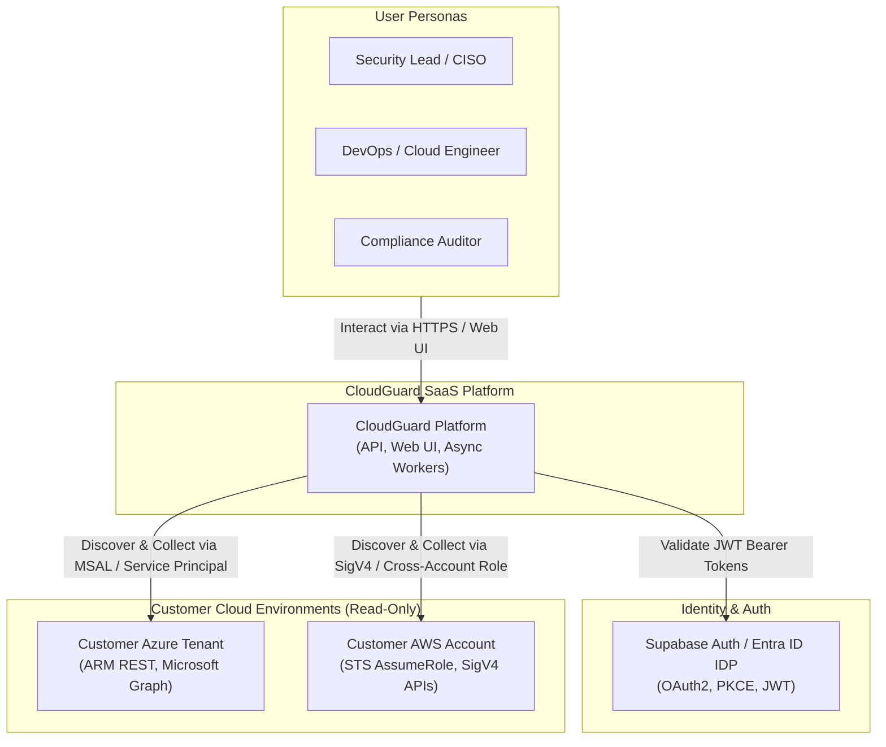
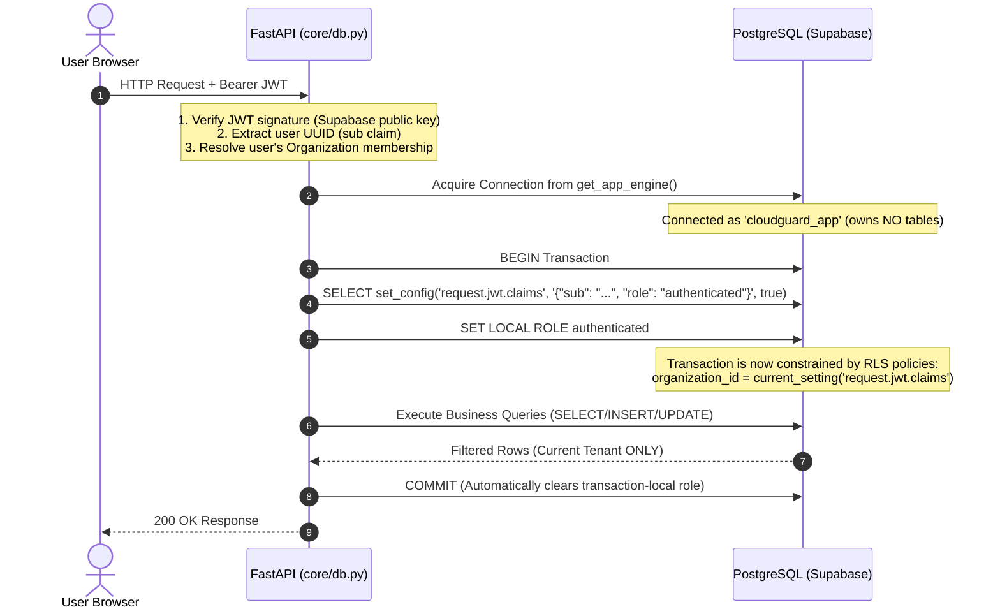
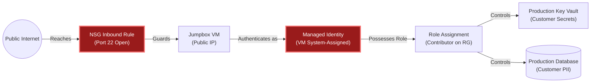
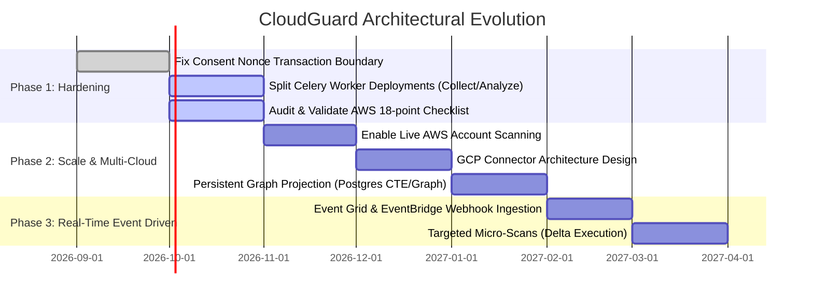

# CloudGuard — Architecture Review (September 2026)

**Date:** 20 September 2026  
**Scope:** Full-stack architecture (`apps/api`, `apps/web`), Data & Security tier (`database/`), Cloud Connectors (`Azure`, `AWS`), Distributed Scan Orchestrator (`Celery`/`Redis`), and Infrastructure (`Railway`, `Supabase`, `Vercel`) at commit `f7de6b0` (`develop-eh`).  
**Predecessor Review:** [`docs/ARCHITECTURE_REVIEW.md`](ARCHITECTURE_REVIEW.md) (September 3, 2026).

---

## 1. Executive Summary

**CloudGuard** is an Azure-first (with AWS built behind a feature flag), cloud-native Cloud Security Posture Management (CSPM) SaaS. Rather than operating as an alert generator that dumps thousands of disconnected misconfigurations on security teams, CloudGuard is designed as a **deterministic, evidence-backed, risk-prioritizing verification platform**.

### The Verified Product Loop

```
                                    ┌──────────────────────────────────┐
                                    │    THE VERIFIED PRODUCT LOOP     │
                                    └──────────────────────────────────┘
                                                     │
               ┌─────────────────────────────────────┴─────────────────────────────────────┐
               ▼                                     ▼                                     ▼
     1. READ-ONLY CONSENT                   2. DETERMINISTIC ENGINE               3. ZERO-TOUCH VERIFICATION
  No stored customer secrets.           UNKNOWN is never PASS.               No human "Mark as Resolved" button.
  Entra ID multi-tenant app grant       Coverage gaps tracked in ledger.     Fixed findings auto-resolve on
  with generated least-privilege role.  Risk = Severity x Context x Exposure. next scan via verified evidence.
```

1. **Self-Verifying Remediation Loop:** The product omits any manual "Mark as Resolved" button. A finding transitions to `RESOLVED` if and only if a subsequent scan provides deterministic evidence that the condition is fixed.
2. **Facts vs. Risks Separation:** Technical misconfigurations ("Port 22 open") are facts. Risks ("Internet-exposed jump box with Subscription Contributor rights") are scored contextually using asset criticality, data sensitivity, and network topology.
3. **Defense-in-Depth Multi-Tenancy:** Isolation is enforced at the application layer via authenticated JWT tenant derivation *and* independently at the PostgreSQL storage layer via Row-Level Security (RLS) executing under non-owner roles (`cloudguard_app` and `cloudguard_worker`).
4. **Durable, Fenced Distributed Orchestration:** Scans are decomposed into discrete, state-persisted steps (`PLAN`, `COLLECT`, `ANALYZE`) running under time-bound renewable leases with fencing tokens, surviving process crashes and worker redeployments.
5. **Exact One-Pass Severance Graph Analysis:** Rather than just enumerating individual attack paths, CloudGuard computes strategic choke points—identifying the single permission or network link whose removal collapses the maximum number of attack routes.

---

## 2. System Architecture & C4 Topologies

CloudGuard is structured as a **modular monolith with distributed asynchronous workers**. Microservices were intentionally avoided to prevent distributed transaction failures, network serialization overhead, and premature boundary coupling.

### C4 Level 1: System Context Diagram



---

### C4 Level 2: Container Diagram (Runtime Topology)

```mermaid
graph TB
    subgraph Client_Tier ["Client Tier (Vercel Edge Network)"]
        SPA["React 18 SPA\n(Vite, TypeScript, Tailwind CSS v4, shadcn/ui)\nStatic Hosting & CDN"]
    end

    subgraph API_Tier ["API Tier (Railway Cloud)"]
        FastAPI["FastAPI Modular Monolith (Python 3.12)\nUvicorn ASGI Server\nNon-root Container (uid 10001)"]
        AuthMid["Security & Tenancy Middleware\n(JWT Verification, Rate Limiting)"]
    end

    subgraph Worker_Tier ["Worker Tier (Railway Cloud)"]
        CeleryWorker["Celery Worker Cluster (Python 3.12)\nConcurrency: 2 per node"]
        CeleryBeat["Celery Beat Scheduler\n(Periodic Scans, Leases, Retention)"]
        CollectQueue[("Queue: collect\n(I/O-Bound, Provider REST)")]
        AnalyzeQueue[("Queue: analyze\n(CPU/Memory-Bound, Graph & Rules)")]
    end

    subgraph Broker_State ["Cache & Broker (Railway)"]
        RedisCluster[("Redis 7\n(Broker, Celery Result Backend)")]
    end

    subgraph Data_Tier ["Data & Identity Tier (Supabase)"]
        PG[("PostgreSQL 16\n(Session Pooler, IPv4 :5432)")]
        RLS["Row-Level Security Policies\n(Enforced on non-owner roles)"]
        AuthService["Supabase GoTrue Auth\n(JWT ES256/RS256)"]
    end

    SPA -->|HTTPS REST API /api/v1/*| FastAPI
    SPA -->|User Authentication| AuthService
    FastAPI --> AuthMid
    AuthMid -->|RLS-Scoped Connection (cloudguard_app)| RLS --> PG
    FastAPI -->|Enqueue Scan / Task IDs| RedisCluster
    CeleryBeat -->|Schedule Sweepers| RedisCluster
    RedisCluster --> CollectQueue --> CeleryWorker
    RedisCluster --> AnalyzeQueue --> CeleryWorker
    CeleryWorker -->|Lease Heartbeat & Fenced Commits (cloudguard_worker)| RLS --> PG
```

---

## 3. Technology Stack & Infrastructure Matrix

| Layer | Technology | Architectural Rationale & Design Decision |
|---|---|---|
| **Frontend** | React 18, TypeScript, Vite | Fast HMR, type-safe contract with API schemas via `generate_openapi.py`. |
| **Styling & UI** | Tailwind CSS v4, shadcn/ui, Radix | Semantic design tokens, zero runtime CSS overhead, accessible primitives. |
| **Client State** | TanStack Query v5 | Cache management, optimistic mutations, automatic background refetching. |
| **Backend API** | FastAPI, Python 3.12, Pydantic v2 | High-throughput async ASGI, automated OpenAPI schemas, strict data validation. |
| **ORM / Data Access** | SQLAlchemy 2.0 (Async), asyncpg | Raw SQL performance with full type safety; explicit transaction control. |
| **Database** | PostgreSQL 16 (via Supabase) | Native JSONB for raw snapshots, robust RLS engine, recursive CTE graph queries. |
| **Task Queue** | Celery 5.4, Redis 7 | Reliable task distribution, discrete queue routing (`collect` vs `analyze`), scheduling via Celery Beat. |
| **Reports Engine** | Jinja2 + WeasyPrint | Headless HTML-to-PDF rendering; zero client JavaScript dependencies, deterministic pagination. |
| **Target Cloud SDKs** | Raw REST (`httpx`), `aiobotocore` | **Direct REST instead of official Azure SDKs** to capture exact raw JSON for forensic evidence and legal compliance. |
| **Deployment / Infra** | Railway (API/Worker), Vercel (Web), Supabase (DB) | Developer velocity, zero-ops infrastructure, managed database maintenance. |
| **CI / Code Quality** | GitHub Actions, Pytest, Vitest, Ruff, Mypy | Strict typechecking, linting, doc coverage AST gate, automated unit & integration testing. |

---

## 4. Subsystem Deep-Dive

### 4.1 Two-Tier Multi-Tenancy & Row-Level Security (RLS)

Tenancy isolation is implemented with defense-in-depth: the application layer derives the tenant context from the cryptographically verified JWT, and PostgreSQL enforces that tenant context natively through Row-Level Security.



#### The Worker Tenancy Contract (`scan_session`)
In background Celery workers, there is no HTTP request and no user JWT. If workers used the superuser/owner database connection, a bug in worker code could accidentally read or write across tenant boundaries.
- **Architectural Solution:** CloudGuard created a dedicated database role: `cloudguard_worker`.
- Scans run inside `scan_session(organization_id)`.
- Because `SET LOCAL` is transaction-scoped and dies at every `session.commit()`, CloudGuard implements an SQLAlchemy `after_begin` event listener that automatically re-executes `SET LOCAL app.current_organization_id = :org_id` on every new transaction boundary.

---

### 4.2 Distributed Scan Pipeline & Fenced Step Orchestration

A scan is not a monolithic Celery task. If a monolithic task dies mid-way through scanning 50 subscriptions, all progress is lost and duplicate API calls are fired. CloudGuard breaks scans into **discrete, leased steps**:

```mermaid
graph TD
    subgraph OrchestratorLoop ["Durable State Machine (services/scan/pipeline.py)"]
        Start([User or Schedule Triggers Scan]) --> PlanStep["Step 1: PLAN\n(Discovers Subscriptions & Accounts)"]
        PlanStep --> StepGen["Generate Steps in DB:\n- COLLECT (Tenant Directory)\n- COLLECT (Subscription 1..N)\n- ANALYZE (Single Fenced)"]
        
        StepGen --> DispatchCollect["Dispatch to 'collect' Queue"]
        
        subgraph ParallelCollect ["Parallel Collection (I/O Bound)"]
            CollDir["COLLECT: Tenant Directory\n(Entra Users, Groups, Roles)"]
            CollSub1["COLLECT: Subscription 1\n(ARM Resources, NSGs, Disks)"]
            CollSubN["COLLECT: Subscription N\n(ARM Resources, Storage, SQL)"]
        end
        
        DispatchCollect --> CollDir
        DispatchCollect --> CollSub1
        DispatchCollect --> CollSubN
        
        CollDir --> RawDB[("Store Verbatim JSON in\ncloud_snapshots")]
        CollSub1 --> RawDB
        CollSubN --> RawDB
        
        RawDB --> AllDone{"All Collection\nSteps Settled?"}
        AllDone -- No --> Wait["Worker Heartbeats Lease"]
        AllDone -- Yes --> TriggerAnalyze["Dispatch to 'analyze' Queue"]
        
        subgraph SingleAnalyze ["Single Analyze Stage (CPU/Memory Bound)"]
            AnalyzeStep["ANALYZE Step Execution:\n1. Load RawSnapshots\n2. Normalize to CloudResource\n3. Execute 98 Security Rules\n4. Calculate Risk Scores\n5. Build Attack Path Graph & Choke Points\n6. Verify Existing Remediations"]
        end
        
        TriggerAnalyze --> AnalyzeStep
        AnalyzeStep --> AtomicCommit["Atomic ScanWriter.commit\n(Fenced on Step Attempt)"]
        AtomicCommit --> Completed([Scan Marked COMPLETED])
    end
```



#### Lease Fencing & Zombie Prevention
- Each scan step has an `attempt` counter and a `lease_expires_at` timestamp.
- While running, `LeaseKeeper` sends periodic heartbeats every `LEASE_SECONDS / 3`.
- When committing results, `StepFence` verifies that the current worker's attempt matches the database record. If a slow worker was reaped and another worker picked up the step, the zombie worker is fenced out, preventing data corruption.

---

### 4.3 The Evidence Ledger & Rule Engine Algebra

Most CSPMs use a binary evaluation: `PASS` or `FAIL`. This creates a dangerous security vulnerability: **if a cloud API times out or permissions are missing, missing resources appear as "clean", giving a false sense of security**.

CloudGuard enforces a **four-state evaluation algebra**:

$$\text{Verdict} \in \{\text{PASS}, \text{FAIL}, \text{UNKNOWN}, \text{ERROR}\}$$

- **Invariant:** `UNKNOWN` is **never** converted into a `PASS`.
- Missing data is logged in `scan_evaluation_gaps` and `scan_collection_results`.
- Compliance reporting marks controls with missing evidence as `INCONCLUSIVE`, preventing false compliance audit sign-offs.

---

### 4.4 Attack Path Graph & Exact Severance Engine

In `app/graph/severance.py`, CloudGuard solves the problem of finding **choke points** across attack trees.

#### The Graph Architecture
1. **Nodes:** Assets (VMs, Identities, Storage Accounts, Key Vaults, SQL Databases).
2. **Edges:** Capabilities and reachability (`REACHES`, `HAS_IDENTITY`, `ASSUMES_ROLE`, `CONTROLS`).
3. **Severance Question:** *"Which single removable link, if severed, destroys the greatest number of viable attack routes from the public Internet to crown-jewel assets?"*



#### The Exact One-Pass Algorithm
CloudGuard implements a **layered forward reachability traversal**:
- Starting at an Internet entry point, it traverses forward layer-by-layer up to `MAX_DEPTH`.
- It tracks `necessary(v)`: the exact set of removable links present on **every** walk to node $v$:

$$\text{necessary}(v, d+1) = \bigcap_{u \in \text{predecessors}(v)} \left( \text{necessary}(u, d) \cup \{ (u \to v) \mid (u \to v) \text{ is removable} \} \right)$$

- If an edge is present in `necessary(v)`, cutting that edge guarantees that target $v$ is completely unreachable from that entry point.
- **Complexity:** Computes severance for every link in the estate in **a single traversal pass**.

---

### 4.5 Risk Scoring vs. Raw Alert Noise

CloudGuard separates findings (technical observations) from risks (business danger).

$$\text{Risk Score} = \left( \sum_{i} \text{Factor}_i \times \text{Weight}_i \right) \times \text{Scale Factor}$$

Where factors comprise:
1. **Technical Severity:** (`CRITICAL: 10`, `HIGH: 7`, `MEDIUM: 4`, `LOW: 1`)
2. **Asset Criticality:** Inferred from tags (`env=prod`), naming, or declared customer overrides.
3. **Data Sensitivity:** Inferred from data types stored (PII, secrets, payment data).
4. **Internet Exposure:** Direct public IP, public DNS, or open NSG/Security Group.
5. **Exploitability:** Known CVSS/exploit maturity for the vulnerability.
6. **Business Impact:** Computed harmonic mean of Criticality and Sensitivity.

#### Dual-Score Philosophy
- `score` (Cautious): Missing context (`UNKNOWN`) is scored near `HIGH` so unclassified assets are prioritized for triage rather than ignored.
- `known_score` (Grounded): Uses only verified facts. The company's headline security posture score is calculated using `known_score`, ensuring CloudGuard's internal blind spots do not artificially penalize the customer's score.

---

## 5. Architectural Decisions (ADR Synthesis)

CloudGuard maintains an exemplary architectural record (`docs/DECISIONS.md`) comprising over 120 recorded decisions. The table below highlights the foundational decisions:

| ADR Ref | Decision | Trade-Off Accepted | Long-Term Architectural Validation |
|---|---|---|---|
| **§1** | RLS enforced against non-owner database role | Slight connection setup overhead. | **Major Win.** Zero cross-tenant leakage vulnerability possible even if an API endpoint forgets an `org_id` WHERE clause. |
| **§3** | Direct REST over Azure SDKs (`azure-mgmt-*`) | Must manually maintain API URL paths and JSON schemas. | **Critical Win.** Enables storing bit-for-bit verbatim raw JSON snapshots in `cloud_snapshots` for immutable evidence, replay, and offline testing. |
| **§5 & §6** | Four-state rule algebra; UNKNOWN is never PASS | Gaps must be tracked in database tables; compliance cannot show 100% easily. | **Industry Leading.** Eliminates false negatives during cloud provider throttling or outages. |
| **§10 & §18**| Auto-verification by scan; no human override | Users cannot manually close tickets in UI without fixing the infrastructure. | **High Integrity.** Guarantees the dashboard reflects reality, not wishful thinking. |
| **§11** | Supabase Auth only (JWT RS256/ES256) | Vendor dependency on Supabase GoTrue protocol. | **High Security.** API never touches, hashes, or stores user passwords. |
| **§13** | Cloud-only runtime; no `docker-compose` | Local setup requires connecting to cloud DB and Redis. | **High Realism.** Developers test against real PostgreSQL RLS and real provider constraints. |
| **§16 & §65**| Durable step pipeline with Redis queues & leases | Scans require Celery workers and Redis broker. | **Fault Tolerant.** Scans survive worker crashes, API redeploys, and cloud API transient errors. |
| **§49** | Exact forward layer severance choke point math | Complex graph theory implementation. | **High ROI.** Changes recommendations from "fix 500 alerts" to "cut this 1 role assignment to kill 42 attack paths". |

---

## 6. Architectural Risks & Recommendations

| Priority | Area | Finding / Risk | Recommended Refactoring |
|---|---|---|---|
| **P1** | **Auth / State** | Consent nonce clearing in `cloud_connections.py:353` occurs before external network calls; a failure rolls back the clear. | Commit the nonce invalidation immediately in an isolated transaction before calling external provider APIs. |
| **P1** | **Workers** | Single Celery worker handles `celery,collect,analyze`. Heavy `analyze` jobs starve light `collect` tasks. | Split Railway worker configuration into two services: `worker-collect` (concurrency 8) and `worker-analyze` (concurrency 1-2). |
| **P2** | **Multi-Cloud** | AWS connector and 46 rules exist behind `AWS_ENABLED=false` (`docs/AWS_INTEGRATION.md`). | Execute the 18-point live account validation checklist to promote AWS to General Availability. |
| **P2** | **Scalability** | `AssetGraph` is constructed in-memory per scan. | For tenants with >50k assets, implement persistent graph models in PostgreSQL using recursive CTEs or pgvector. |
| **P3** | **Event-Driven** | Scans currently run on interval schedules. | Ingest Azure Event Grid & AWS EventBridge webhooks to trigger delta micro-scans on modified resources. |

---

## 7. Evolution Roadmap


