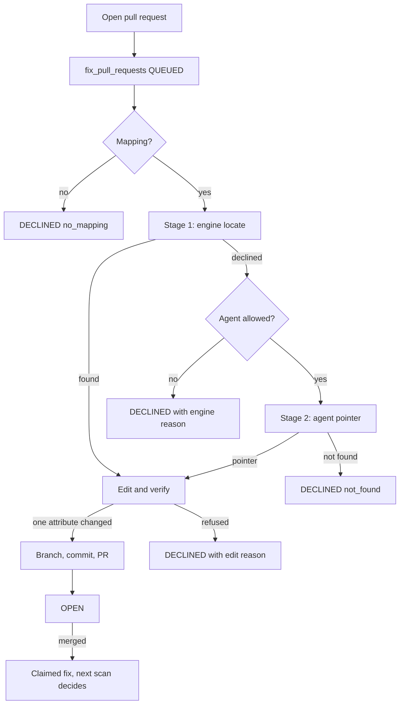

# Fix-as-Code pull requests: design

Status: draft for review, 2026-10-04. This is the design for Phase 2 of
[Fix-as-Code](../../FIX_AS_CODE.md), changed by three decisions made while brainstorming: the
upload flow is removed, Bicep is edited as well as Terraform, and a read-only agent locates the
block a deterministic search cannot. It is for whoever reviews the spec before the implementation
plan is written.

## Contents

- [Goal](#goal)
- [Decisions taken](#decisions-taken)
- [Flow](#flow)
- [Edit engine](#edit-engine)
- [Locating the block](#locating-the-block)
- [Data model](#data-model)
- [Agent guardrails](#agent-guardrails)
- [Interface](#interface)
- [Testing](#testing)
- [Rollout](#rollout)
- [Out of scope](#out-of-scope)
- [Changes to existing documents](#changes-to-existing-documents)
- [Proposed DECISIONS entry](#proposed-decisions-entry)
- [Open questions](#open-questions)

## Goal

A failing finding gets a reviewable pull request (PR) against the customer's own infrastructure
code, which a person merges. The next scan, never the merge, decides whether the finding is fixed
(DECISIONS §190).

Success looks like this:

- A member opens one PR per finding from its fix card, and a second click opens no second PR.
- Where CloudGuard cannot stand behind an edit, it declines with a reason a person and a machine
  can both read. A decline is an answer, not an error.
- The share of PRs located by the engine alone and by the agent, and the decline reasons, are
  measured from the first day. Phase 1 measured the upload flow; nothing yet measures a repository.

## Decisions taken

These came out of the brainstorm and are the premises of everything below.

1. **GitHub first, through a GitHub App** (not personal access tokens), no auto-merge, never a
   push to a default branch (§190).
2. **The agent is hybrid.** The deterministic engine locates first. Only when it declines does a
   CloudGuard-hosted agent read the repository, and it returns a pointer, never an edit. The agent
   is opt-in per organization and per repository mapping.
3. **The agent is a locator only** in the first release. An agent that writes edits (variables,
   module inputs, missing nested blocks) is a later phase with its own decision.
4. **The upload flow is removed.** `POST /findings/{id}/iac-diff`, its multipart handling,
   `IacDiffCheck` and the `sole_block` option go, because "the only block in this file" means
   nothing in a repository CloudGuard searched. The agent does the work `sole_block` did.
5. **The fix card shows CLI, Terraform and Bicep as copyable snippets, plus Open pull request.**
   There is no download and no upload.
6. **Terraform and Bicep PRs, in two milestones on this one spec.** M1 is the GitHub App, the
   tables, the Terraform PR and the agent locator. M2 is the Bicep dialect and its PR path. M1
   ships without M2.

## Flow

One finding becomes at most one open PR:

1. A member selects **Open pull request** on the fix card or in the fix sheet's header. The route
   is `POST /findings/{id}/pull-request`, marked `dependencies=[Costly]`, refused in the demo
   organization (§99). It records a `fix_pull_requests` row in `QUEUED`, commits the request's
   transaction, and answers `202` with `Location` and `Retry-After` (§194).
2. A Celery task claims the row under a lease. Provider calls are made outside any transaction,
   and a refused enqueue is recorded in a fresh `rls_session` (§158, §164).
3. **Candidates.** The finding's subscription or resource group selects `repo_mappings`. With no
   mapping the task declines with `no_mapping`.
4. **Locate.** Stage 1 reads each candidate repository's tree through the Git Data API (no clone,
   with file-count and byte caps) and runs the dialect's `locate()` over `*.tf` and `*.bicep`.
   Stage 2, only when stage 1 declines and the mapping allows the agent, asks the
   [locator agent](#agent-guardrails) for a pointer.
5. **Provider version.** Terraform's provider version is read from `required_providers` and
   `.terraform.lock.hcl` in the tree. An unknown or out-of-range version declines. Bicep reads the
   resource's API version from the file instead.
6. **Edit.** The dialect edits the located block and its verifier re-parses: exactly one attribute
   changed, nothing else. Otherwise the task declines.
7. **Open the PR.** Code with no model in it creates the blob, tree, commit and branch
   `cloudguard/fix-<rule>-<short>`, then the PR. The body is a template: the rule, the expected
   state in its `describes` wording, a link to the finding, and "located by agent" when stage 2
   was used.
8. **Close the loop.** The App's webhook on merge records a claimed fix in the existing
   verification (`services/verification.py`). The next scan's PASS resolves the finding.

The route holds no query (`tests/unit/test_thin_routes.py`): `services/pull_requests.py` flushes,
and the route commits. Roles: owners and admins connect integrations; members and above open PRs;
every action goes through `services/audit.record` (§163).

## Edit engine

`app/remediation/iac/` already holds the Terraform engine (`terraform.py`: `edit_terraform`,
`Edit`, `Change`). This work puts `locate()` and `patch()` behind an `IacDialect` interface and
adds Bicep as the second implementation. Both parse with tree-sitter for exact byte ranges, parse
and never evaluate, and run under size, depth and time caps.

The rule of §190 holds for both dialects: **one value, in a block that already exists, whose value
is a literal.** The engine replaces one value's byte range, or adds one optional argument after the
block's last one at its indent. It never creates a resource or a nested block.

Decline reasons, each machine-readable:

| Case | Terraform | Bicep |
|---|---|---|
| Name is an expression | `interpolated_name` | name is a `param`, `var` or expression |
| Value comes from elsewhere | variable or module input | `param`, `var` or module output |
| Resource is repeated | `count` or `for_each` | inside a loop |
| Not a definition | -- | `existing` resource |
| Several blocks match | more than one match | more than one match |
| Nested block absent | `nested_block_missing` | nested object absent |
| Version unknown | provider outside checked range | API version outside checked range |

Collection states (`NONE_MATCHING`, `NOT_EMPTY`) stay structural edits and are not attempted
(§190). A rule with no attribute shows only its CLI tab, and Open pull request is unavailable with
the reason.

**Verifying what is written down.** `terraform_attribute` is already held to the azurerm 3.117.1
and 4.81.0 schemas (`tests/unit/test_terraform_hints_schema.py`). `bicep_property` (deferred in
Phase 0 because nothing read it) is added to `ExpectedState` with the same rule: it is never
derived from `arm_alias`, and a test holds each one to a trimmed fixture of the published Azure
Bicep resource types (`Azure/bicep-types-az`) for its property path, its type and its API-version
range. A rule whose property is not yet verified shows "no Bicep snippet", never a guess.

## Locating the block

`repo_mappings` narrow the repositories; the tree is read through the Git Data API and capped.
Stage 1 matches the resource type and a literal name, as `locate()` does today. Public samples
match a literal name on about 1% of blocks (Phase 1, `tools/iac/hit_rate.py`), so stage 2 is not an
edge case: it is how most real repositories are expected to be reached. That expectation is a
hypothesis. M1 measures it (see [Rollout](#rollout)) and the open questions record what to do if
it is wrong.

A Terraform state address, or evaluating simple interpolations against variable defaults and
`.tfvars`, are alternatives to the agent for stage 2 that Phase 1's notes name. They are not in
this release. The locator's output format is identical, so either can replace the agent later
without touching the edit engine.

## Data model

All three tables get RLS policies and `cloudguard_app` grants, an Alembic migration under
`database/`, and tests that no policy lets another organization read them.

- `code_integrations`: organization, provider (`github`), installation id, `agent_enabled`
  (default false), who connected it and when.
- `repo_mappings`: integration, repository, path glob, the mapped subscription or resource group,
  and `agent_allowed` (default false).
- `fix_pull_requests`: finding, repository, branch, file, PR number and URL, `state`, a
  machine-readable `decline_reason`, `located_by` (`engine` or `agent`), attempt, lease columns and
  `agent_run_id`.

`state` is one of `QUEUED`, `LOCATING`, `OPEN`, `MERGED`, `CLOSED`, `DECLINED`. A unique partial
index on finding, repository and file while a PR is open gives idempotency: a second request
returns the existing row.

Not stored: installation tokens (minted per task, valid an hour), file contents, the diff. The
GitHub App's private key is a server environment variable.

## Agent guardrails

Repository contents are untrusted input and can carry instructions aimed at the model. The design
makes the agent unable to do harm, so that it need not be trusted.

- **Two opt-ins.** An organization enables `agent_enabled` once, with a plain statement that file
  contents of declined cases are sent to the model provider. Each mapping then opts in with
  `agent_allowed`, so a sensitive repository stays engine-only.
- **Read-only tools, hard caps.** `list_tree`, `read_file` and `grep`, scoped to mapped
  repositories and paths. Caps on files, bytes, tool calls and wall-clock time per run. Files are
  read as text and parsed, never executed.
- **Data, not instructions.** Repository text is passed delimited as data. The output is a strict
  schema, `{file, block_address}` or `not_found`. A pointer is accepted only if the file exists in
  the mapped tree and the block parses as a resource of the rule's type; anything else is
  `not_found`.
- **No reach.** The agent has no write tool and cannot influence the edit, the branch or the PR
  body. At worst a hostile repository makes it name the wrong block, and the deterministic
  verifier and a human reviewer see the diff.
- **The model narrates and never decides** (§167). The verifier decides.
- **A record.** Each run stores its tool calls and the pointer it returned under `agent_run_id`,
  redacted of file contents.

## Interface

Settings > Integrations gets a GitHub card (connect, installation status, the organization's agent
toggle) and a mapping editor in a sheet, following the existing `?account=` pattern (§207).

The fix card and the fix sheet (§202, §205) show three tabs and one action:

- **CLI**, **Terraform** and **Bicep**: copyable snippets, with placeholders filled by
  `lib/remediationFill.ts` where they apply. Terraform and Bicep show only where the rule has a
  verified attribute or property.
- **Open pull request**: the one action. An unavailable button stays focusable as `aria-disabled`
  and its reason is spoken through `LiveStatus` (§165).
- After a request, the card shows the PR's state read through TanStack Query, a link to the PR,
  and, when the agent located the block, a line asking the reviewer to check it is the asset.

Copy lives in `i18n/en.ts` within the line budget (§166), and `lib/pageTitle.ts` is updated for any
new route. Fix-card tabs carry no icon beyond `lib/icons.ts`.

Removed from the interface: the upload control and the Download IaC diff action.

## Testing

- **Engine.** Fixtures per dialect for the happy path and every decline case. Bicep adds
  `existing` and loops. Provider-range and API-range cases. A property test that an edit changes
  exactly one attribute and every other byte survives.
- **GitHub layer.** A fake GitHub server for the Git Data and PR endpoints, covering idempotency, a
  stale base branch, a refused enqueue recorded in a fresh `rls_session`, a lease taken over
  mid-task, and a webhook replay.
- **Agent.** A recorded-run harness with fixed tool traces. A hostile repository (an injected
  instruction in a comment, a pointer outside the mapping, a file that does not exist) must yield
  `not_found` and never a write. Pointers outside the tree fail schema validation.
- **Security.** RLS isolation for all three tables. Every write is refused in the demo
  organization. Members open PRs; only owners and admins connect. The installation token is never
  in a log, a row or a response.
- **Frontend.** Vitest with axe on the tabs and the button. A decline is spoken through
  `LiveStatus`; the unavailable button stays focusable.
- `tests/unit/test_typed_responses.py` and `tests/unit/test_thin_routes.py` cover the new routes.

## Rollout

- Behind `FIX_PRS_ENABLED`, off by default, following the `AWS_ENABLED` pattern. The GitHub App is
  registered against a test organization first.
- The agent toggle is off per organization and per mapping until someone turns it on.
- **Measure before widening.** Every request logs `located_by` and the decline reason. The first
  review after real use answers whether stage 2 carries the load, and where PRs are declined.

## Out of scope

- GitLab, Azure Repos and Bitbucket. GitLab needs `core/outbound` extended to GET and PUT with
  address pinning (§164).
- Collection edits: removing a rule from an NSG, Bicep arrays.
- AWS and CloudFormation; AWS stays behind `AWS_ENABLED`.
- Auto-merge, and anything that pushes to a default branch.
- An agent that proposes edits, and an agent that reads CI and iterates. Each needs its own spec
  and a DECISIONS entry first.

## Changes to existing documents

To be made with the implementation, in the same pull request (`docs/MARKDOWN_GUIDELINES.md`,
principle 2):

- `docs/FIX_AS_CODE.md`: drop the upload and Download IaC diff language, mark the sole-block
  section superseded, add the Bicep and agent-locator phases, and update the status line and open
  decisions.
- `docs/DECISIONS.md`: the entry below.
- `tools/iac/hit_rate.py`: remove `--sole-block`.
- `README.md` and `CLAUDE.md`: where they describe fix-as-code or the upload.

## Proposed DECISIONS entry

Proposed as the next number after §218; to be confirmed when written.

> **A pull request edits one literal value in a block that exists, and a model may only point at
> the block.** Fix-as-Code opens a pull request through a GitHub App, on its own branch, never to
> a default branch and never merged; a merge records a claimed fix and the next scan decides
> (§190). The edit is Terraform's or Bicep's, one literal value or one optional argument added to
> an existing block, verified by re-parsing; the declines of §190 apply to both dialects. Where
> a deterministic search cannot find the block, a read-only agent may return a pointer to it, if the
> organization and the repository mapping both allow it. The pointer is checked against the tree,
> the edit is the engine's, and the diff is a person's to review; the model narrates and never
> decides (§167). The upload flow and `sole_block` of §190 are removed: "the only block in the
> file" was a person's choice of file, which a searched repository does not have.

## Open questions

1. **Does stage 2 carry the load?** If the agent's `not_found` rate is high, the fallback options
   are Terraform state addresses or variable and `.tfvars` evaluation. The locator contract allows
   either; the choice waits for M1's measurements.
2. **Which model provider and key custody?** The platform has no LLM call in production today
   (rules are deterministic, §167). The provider, who holds the key, the data-processing terms the
   opt-in text must state, and the per-run cost cap are decided before M1 builds the agent.
3. **Webhook delivery.** A merge event needs a public endpoint and signature verification on the
   App's webhook secret. Whether it reuses the outbound webhook machinery (§164) or is a new
   inbound route is settled in the plan.
